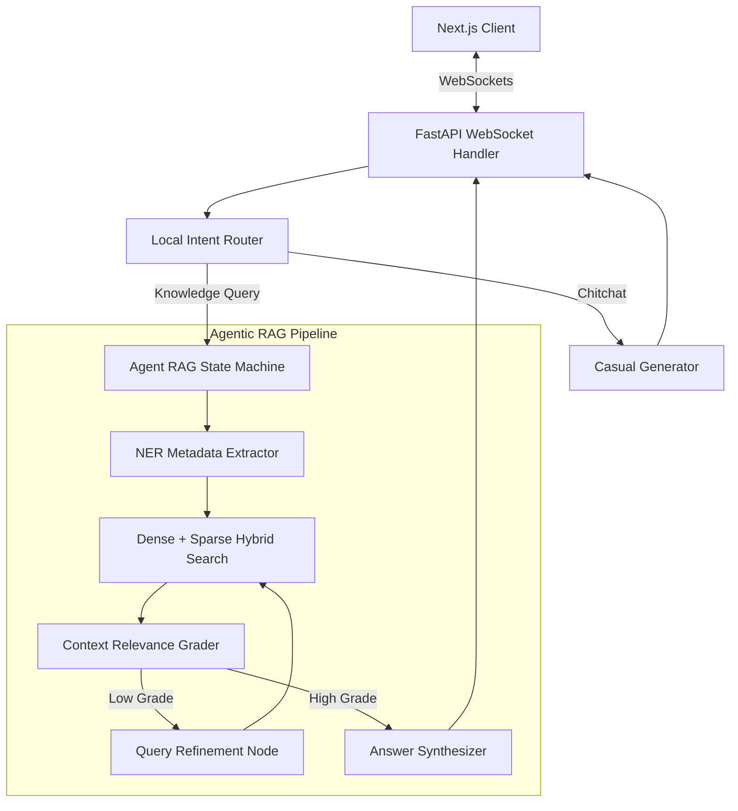

# Chatbot-with-ML-NLP (Aetheris | Next-Gen 3D Agentic RAG Platform)

Aetheris is an enterprise-grade AI Chatbot platform featuring a modular Agentic RAG (Retrieval-Augmented Generation) state-machine backend and a high-performance, immersive 3D Glassmorphic web frontend.

---

## 1. System Architecture



### Backend Capabilities:
- **FastAPI Core**: Handles high-performance WebSocket streaming chunk connections (`ws://localhost:8000/chat`).
- **Semantic Intent Routing**: Uses token overlap and seed matching to determine if a query requires database search or general chitchat.
- **Named Entity Recognition**: Performs regex and keyword extraction to build metadata contexts.
- **Hybrid Retrieval**: Combines BM25-like TF-IDF keyword searching (Sparse) with character n-gram cosine matching (Dense) and merges them using Reciprocal Rank Fusion (RRF).
- **Cross-Encoder Reranker**: Performs LCS sequence alignment and bigram checks to evaluate semantic matching.
- **State Machine Execution**: Processes queries sequentially through grading and refinement paths.

### Frontend Capabilities:
- **Next.js App Router**: Optimized layout tree built with React and TypeScript.
- **3D Particles Background**: React Three Fiber + WebGL rendering a responsive particle cloud that reacts to mouse coordinates.
- **Glassmorphic UI**: Hardware-accelerated CSS styling using sub-pixel rendering (`transform: translateZ(0)`) and backdrop filters for smooth 60 FPS visual blends.
- **Pipeline Progress Tracker**: Live horizontal flowchart highlighting the active node inside the backend RAG state loop.

---

## 2. Directory Structure

```
chatbot-master-project/
├── frontend/
│   ├── src/
│   │   ├── app/
│   │   │   ├── layout.tsx
│   │   │   └── page.tsx
│   │   ├── components/
│   │   │   ├── ThreeCanvas.tsx    # Interactive R3F 3D backdrop
│   │   │   ├── ChatWindow.tsx     # Message stream interface & RAG tracker
│   │   │   ├── GlassCard.tsx      # Premium glass container overlay
│   │   │   └── ToggleButton.tsx   # Framer Motion animated mode switcher
│   │   ├── styles/
│   │   │   └── globals.css        # Glassmorphism classes & Tailwind v4
│   │   └── hooks/
│   │       └── useWebSocket.ts    # Custom WebSocket hooks & state updates
├── backend/
│   ├── app/
│   │   ├── __init__.py
│   │   ├── main.py                # FastAPI server + WebSocket stream
│   │   ├── nlp/
│   │   │   ├── router.py          # Intent classification logic
│   │   │   └── ner.py             # Entity extraction parser
│   │   ├── rag/
│   │   │   ├── search.py          # Dense + Sparse hybrid fusion execution
│   │   │   └── rerank.py          # Cross-encoder ranking logic
│   │   └── agent/
│   │       ├── graph.py           # Core agentic state execution loop
│   │       └── tools.py           # Retrieval and external search tools
│   └── requirements.txt
└── README.md
```

---

## 3. Quick Start Guide

### Prerequisites:
- Python 3.10+
- Node.js 18+

### Setup Backend:
1. Navigate to the backend directory:
   ```bash
   cd backend
   ```
2. Create and activate a virtual environment:
   ```bash
   python -m venv venv
   # On Windows:
   venv\Scripts\activate
   # On Mac/Linux:
   source venv/bin/activate
   ```
3. Install dependencies:
   ```bash
   pip install -r requirements.txt
   ```
4. Run the FastAPI development server:
   ```bash
   python app/main.py
   ```
   The backend will start on [http://localhost:8000](http://localhost:8000) (WebSocket connection: `ws://localhost:8000/chat`).

### Setup Frontend:
1. Navigate to the frontend directory:
   ```bash
   cd frontend
   ```
2. Install npm dependencies:
   ```bash
   npm install --ignore-scripts
   ```
3. Launch the Next.js development server:
   ```bash
   npm run dev
   ```
   Open your browser and navigate to [http://localhost:3000](http://localhost:3000) to view the Aetheris 3D Interface.

---

## 4. Verification & Testing

To check that the WebSocket connection is streaming correctly:
1. Open the Chat Interface at `http://localhost:3000`.
2. Observe the connection indicator (Green light indicates online connection).
3. Type a knowledge query like: `"Explain RAG architecture"` or `"Tell me about React Three Fiber"`.
4. Observe the horizontal **Pipeline Stage Tracker** update dynamically as the backend traverses `NER_EXTRACTOR` -> `INTENT_ROUTER` -> `RETRIEVER` -> `RELEVANCE_GRADER` -> `GENERATOR`, streaming tokens dynamically into the message cards.
